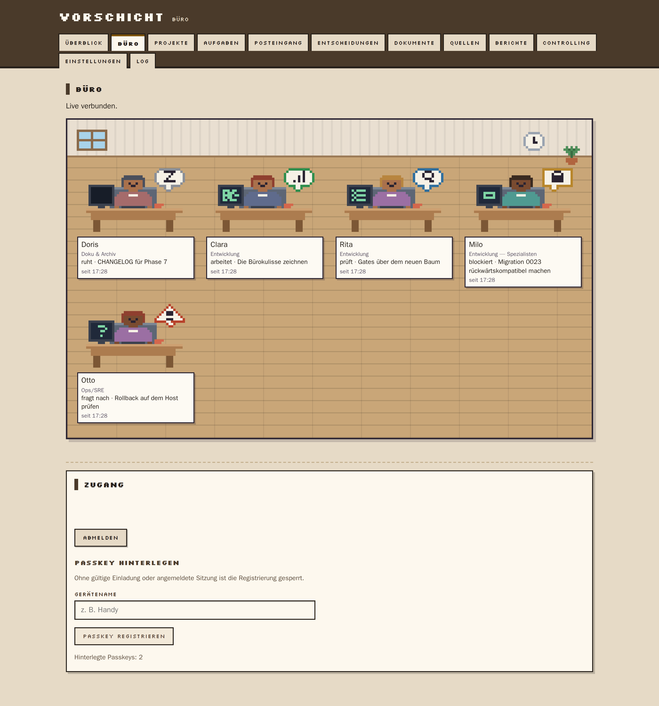
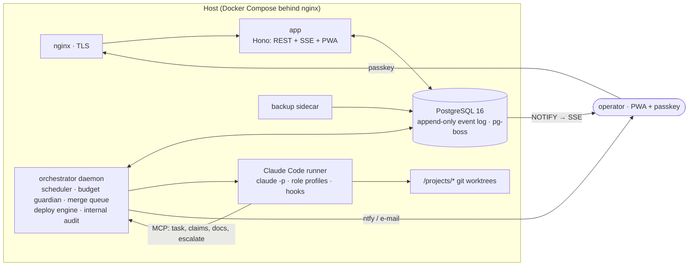

# Vorschicht

**An autonomous software studio on a Claude subscription.** Vorschicht ("the shift before yours") is
a 24/7 orchestrator that plans, builds, reviews, tests, merges, deploys and documents across your
projects using **Claude Code in headless mode** — and escalates only real decisions to you, as
prepared multiple-choice questions. It runs on a personal Claude subscription via Claude Code, by
design without an API key and without API costs.

> **Status: experimental — not in production use.** Phases 0–8 of the build plan are closed and
> tested (≈3 000 tests, ~100 of them browser cases); Phase 9, the supervised pilot, has not started.
> The studio has never worked on a real writable project, and the reference deployment is stopped.
> Issues and pull requests are welcome; see [Status & roadmap](#status--roadmap).
>
> **Gates (CLAUDE.md §22):** 65 green · 5 deferred · 9 open — counted by
> `infra/scripts/gate-doku.mjs` on every gate run, which fails when this line disagrees with the spec.



## Why

Every serious defect an AI-assisted build ships and later catches tends to belong to one class: the
test encoded the same misunderstanding as the code, so a gate went green on a claim nobody had tried
to falsify. Vorschicht is an attempt to build the *organisation* around a coding agent rather than a
better prompt: locked quality gates that cannot be un-checked, a merge queue that tests the exact tree
that becomes `main`, a budget guardian that never lets a subscription window hit 100 %, containment
hooks that stop an agent writing outside its claim set — and an **internal audit department** whose
only job is to check whether what the studio says about itself is true, with the power to un-tick a
phase.

## Features

- **Budget guardian** on official rate-limit data: soft-stop at 85 % of *any* window (5-hour, weekly,
  per model class), hard ceiling at 95 %, parked work resumes first after the reset, wrap-up protocol
  instead of limit crashes. *(§7, ADR 0001, 0005)*
- **Model access layer** with a headless Claude Code backend, typed contingency backends and a fake
  backend for tests; a billing-change radar raises a P0 the moment the vendor announces a change.
  *(§6.0)*
- **Six locked gates** (tests, typecheck, lint, gitleaks, build, peer review) plus ten optional ones
  (E2E, axe, Lighthouse budget, legal review, licences, SAST, migration review, docs, CHANGELOG);
  every finding is a blocker, infra failures are retried and never count as red. *(§11)*
- **Planner → Coder → Reviewer chain** in git worktrees with file claims; overlapping claims are
  serialised; a merge queue rebases, runs the full gate suite on the rebased tree and fast-forwards.
  *(§8.1, §10)*
- **Containment** via `PreToolUse` hooks: writes outside worktree ∧ claims and reads of secret files
  are denied before execution, verified against the pinned CLI. Nightly gitleaks over transcripts.
  *(§6.6, ADR 0004)*
- **Deploy engine** with health check and automatic rollback (`compose`, `static-rsync`, `none`);
  self-deploy always needs the operator's approval. *(§12)*
- **Escalation inbox with policy memory:** the same question is never asked twice; answering
  resumes the exact parked session with the decision injected. *(§15, §6.4)*
- **Betriebsprüfung (internal audit):** eight rotating domains, recorded sampling, evidence-before-
  claim method, a `gate_invalid` finding un-ticks the gate in `CLAUDE.md` and reopens the phase.
  Sample reports in `docs/pruefberichte/`. *(§8.2)*
- **Dashboard PWA** (German UI): overview, an "office view" with desks and avatars fed by SSE, full
  drill-down from a desk to the transcript line of a decision in three clicks, passkey auth with
  two-credential bootstrap, zero axe violations, Lighthouse 96 on a throttled mobile profile.
  *(§17, §19)*
- Document vault with full-text search, source registry with five trust levels, weekly report,
  idle audits, watchdog, nightly backups. *(§13–§21)*

## Architecture



Everything meaningful is appended to `event_log`; Postgres `NOTIFY` fans out to the SSE hub; the PWA
renders live. All model access flows through the model access layer — no component ever calls
`claude` outside it. The full specification is [`CLAUDE.md`](CLAUDE.md) (it binds every session
working on this repo and is read as *data* by the audit); the reasoning behind the decisions is in
[`docs/adr/`](docs/adr/); the component map is in [`docs/ARCHITECTURE.md`](docs/ARCHITECTURE.md).

## Quick start

Requirements: Docker with Compose v2, Node 22, pnpm 11 (`corepack enable`), a Claude subscription
and the [Claude Code CLI](https://docs.claude.com/en/docs/claude-code) for `claude setup-token`, an
[ntfy](https://ntfy.sh) server or account (push notifications are not optional — the studio refuses
to start without a token).

```bash
git clone https://github.com/Juice-de-Orange/vorschicht.git
cd vorschicht
pnpm install

cp .env.example .env && chmod 600 .env
$EDITOR .env          # POSTGRES_PASSWORD, SESSION_SECRET, CLAUDE_CODE_OAUTH_TOKEN, NTFY_*,
                      # PUBLIC_ORIGIN, WEBAUTHN_RP_ID; VORSCHICHT_PROJECTS_ROOT on a real host

docker compose -f infra/docker-compose.yml --env-file .env up -d --build
curl http://127.0.0.1:8420/healthz

# first passkey: mint a one-time invite and open the printed URL
docker compose -f infra/docker-compose.yml --env-file .env exec app node dist/cli/invite.js
```

The orchestrator applies database migrations on start. For a local trial `PUBLIC_ORIGIN=http://localhost:8420`
and `WEBAUTHN_RP_ID=localhost` work; for a real host put nginx in front (template in `infra/nginx/`,
installer `infra/scripts/install-host.sh`, host-specific volumes in
`infra/docker-compose.override.example.yml`). Operations — start/stop, backups, token renewal,
passkey rescue, the watchdog, disk space — are in [`docs/OPERATIONS.md`](docs/OPERATIONS.md).

`VORSCHICHT_PROJECTS_ROOT` is the host directory the orchestrator gets **read-write** at `/projects`.
Unset, the base compose file uses `infra/.vorschicht-data/projects` inside the checkout; on a real
host point it at a directory that holds project checkouts and nothing else — never `/opt` or a home
directory as a whole.

The compose project name is fixed to `vorschicht` (`name:` in `infra/docker-compose.yml`): containers
are `vorschicht-<service>-1`, volumes `vorschicht_*`, and the operations scripts address them by
those names. A second stack on the same host therefore needs `docker compose -p <other-name> …` on
every command, and the `*-remote.sh` scripts will not find it.

### First project

A healthy stack has no project of yours yet, and the dashboard cannot create one. Projects come in through
the onboarding analysis (§20): `infra/scripts/onboard-remote.sh` on the host the stack runs on, or
`pnpm onboard` from a checkout. Both start a real Claude Code session — **this step needs the Claude
subscription** and spends its budget. The procedure is in
[`docs/OPERATIONS.md`](docs/OPERATIONS.md#first-project-onboarding-20).

**Account prerequisite (do this once):** in your Anthropic account, usage credits / extra usage must
be **disabled or capped at 0**. Vorschicht refuses to start if `ANTHROPIC_API_KEY` is set at all, but
only the account setting covers the account. Anthropic has announced, paused and promised to rework
the billing of programmatic use (`claude -p`); the studio watches for that and treats it as its #1
external risk (§6.0), but it cannot prevent it.

## Tech stack

TypeScript `strict` · pnpm monorepo (4 packages, 3 apps) · Hono + SSE · pg-boss · PostgreSQL 16 with
Drizzle and append-only triggers (24 migrations) · Vite + React PWA · WebAuthn (`@simplewebauthn`) ·
Zod at every boundary · Biome · Vitest (unit + real-Postgres integration + real-Docker deploy
journeys) · Playwright (incl. axe a11y) · Lighthouse budget · gitleaks · Claude Code CLI, pinned.

## Status & roadmap

Phases 0–8 closed. The five deferred gates all wait on the target host: **P4.G1** the ntfy push demo
on a phone, **P5.G2** `static-rsync` against a real release host, **P6.G2** the radar pilot and
**P6.G5** the idle audit (both need a *writable* project), **P8.G1** the weekly report in a real mail
client — each is marked deferred in `CLAUDE.md` with the scripted check that settles it. The nine open
gates are Phase 9: two weeks of supervised operation, fifteen merged tasks, restore and rollback
drills, a final audit. That is the roadmap, and it needs an operator who runs it.

Good first issues are labelled in the tracker: an English UI (i18n), translating the German
comments of a module, a `localhost` quick-start profile, the dark theme the CSS already prepares, a
CI job that runs `gate-in-container.sh`.

## Development

Everything runs in containers: the gate is a POSIX tool by design and its image is the orchestrator
image's sibling (same node digest, same pinned gitleaks and CLI, unprivileged uid).

```bash
infra/scripts/gate-in-container.sh              # all twelve gate steps, ~6 min on a warm cache
infra/scripts/gate-in-container.sh --only=lint  # one or more steps (build first: --only=typecheck,lint)
infra/scripts/with-test-db.sh pnpm vitest run   # unit + Postgres integration tests
pnpm fix                                        # Biome formatting
infra/scripts/demo-phase3.sh                    # the scripted evidence behind one phase's exit gates
```

The first run is cold: it builds the gate image and fills the pnpm store and the Playwright browser
volume, and takes several times as long (about 20 minutes on the machine it was last measured on).

Details, the paid checks (`pnpm check:*` — they start real sessions and cost subscription budget) and
the screenshot scripts are in [`docs/DEVELOPMENT.md`](docs/DEVELOPMENT.md).

## Contributing

See [`CONTRIBUTING.md`](CONTRIBUTING.md). `CLAUDE.md` is the normative spec: changes to behaviour
start there. A bug fix comes with a test that fails without it; every gate stays green; findings
are blockers. Security reports go through private vulnerability reporting ([`SECURITY.md`](SECURITY.md)).

## Built with

This repository was built almost entirely by Claude Code sessions working against `CLAUDE.md`,
phase by phase, with the exit gates as the contract and the internal audit as the second party.
The build loop itself (`vorschicht-build.sh`) is in the repo; it runs `claude -p` with permissions
skipped and must only ever run in a sandbox. The German test titles and comments are a trace of
that workflow, not a style choice — translating them is a welcome contribution.

## Licence

[Apache-2.0](LICENSE) © 2026 Max Oberrauch. The Silkscreen pixel font is used under the SIL Open Font
License 1.1 (`apps/web/src/styles/schriften/OFL.txt`); third-party tools inside the images (poppler,
gitleaks, supercronic, tini, git, curl, ripgrep) are invoked as separate programs under their own
licences, and the Claude Code CLI is installed at image build time from npm under Anthropic's terms
— it is not vendored here.
