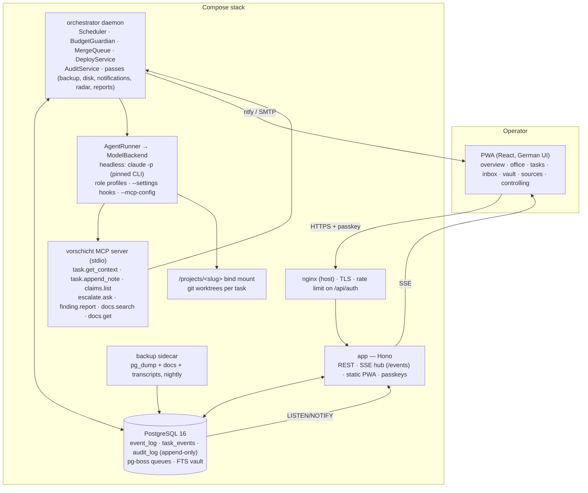

# Architecture

Vorschicht is one Docker Compose stack behind the host's nginx: a Hono API server, an orchestrator
daemon, PostgreSQL and a backup sidecar. Everything meaningful is an appended event; the dashboard
renders from the event log over SSE; every agent session is a headless Claude Code process spawned
by the orchestrator through one model access layer. The normative description is `CLAUDE.md`; this
page is the map.

## Components

| Component | Package | Responsibility |
|---|---|---|
| **Event log** | `packages/db`, `packages/core/src/event-log.ts` | Append-only source of truth. Postgres triggers refuse UPDATE, DELETE and TRUNCATE; `NOTIFY` fans out to the SSE hub. `tasks` is a view over `task_events` (A43). |
| **Scheduler** | `packages/core/src/scheduler.ts`, `apps/orchestrator/src/build-scheduler.ts` | Ticks every 15 s: dispatches queued tasks under the guardian's concurrency, drains the merge queue, resumes parked work, skips read-only projects. |
| **Budget guardian + usage meter** | `packages/core/src/usage-meter.ts`, `guardian.ts`, `controlling/` | Official rate-limit snapshots (ADR 0001) plus an estimating meter (ADR 0005); states `normal` / `wrap_up` / `hard_stop` on every window; wrap-up protocol; pause switch. |
| **Model access layer** | `packages/core/src/backend/` | `ModelBackend` contract; `headless` (`claude -p`, stream-json), `fake` (tests), typed stubs for `interactive-pty` and `api-key`; three independent run caps (A32). |
| **Agent runner + profiles** | `packages/core/src/runner.ts`, `profiles/` | Builds the session spec per role (prompt, tools, model tier, result schema, containment settings), persists the run and its transcript, validates the result contract (ADR 0002). |
| **Containment** | `packages/shared/src/containment.ts`, `packages/core/src/hook-entry.ts` | `PreToolUse` hook: deny writes outside worktree ∧ claims, deny reads of secret patterns; the protocol is measured against the pinned CLI (ADR 0004). |
| **MCP server** | `packages/mcp` | Stdio server the CLI spawns per session; binds the session to exactly one task (ADR 0003). |
| **Dev chain** | `packages/core/src/dev-chain.ts`, `claim-registry.ts`, `worktree*.ts` | Planner → Coder → Reviewer; file claims with the overlap invariant (A45); one worktree and branch per task; red path (requeue once, then escalate). |
| **Gates** | `packages/core/src/gate-suite.ts`, `gates/`, `sandbox-*.ts` | Six locked + ten optional gates; findings vs infra failures with per-step retry (A25, A67); the project's own suite is `infra/scripts/gate.mjs`. |
| **Merge queue** | `packages/core/src/merge-queue.ts` | Per project, FIFO by priority: rebase → full gate suite on the rebased tree → fast-forward → release claims → deploy. Every commit brought in must be the bot's. |
| **Deploy engine** | `packages/core/src/deploy/` | `compose`, `static-rsync`, `none`; health polling, automatic rollback, migration stop, self-deploy approval (A12); release history. |
| **Escalations + policy memory** | `packages/core/src/agent-channel.ts`, `escalation*.ts`, `packages/shared/src/escalation.ts` | Inbox items with researched options; precedent search before escalating; resume of the exact session with the decision injected; ntfy + mail reminders. |
| **Betriebsprüfung** | `packages/core/src/audit/` | Eight domains, recorded sampling, `gate-book.ts` reads `CLAUDE.md` as data and un-ticks a gate on `gate_invalid`; reports in `docs/pruefberichte/`. |
| **Onboarding** | `packages/core/src/onboarding/` | Survey a repository, propose gates/commands/claims/deploy, verify every command against the repo's manifests, apply a verified proposal as a separate act (A41). |
| **Vault, sources, radar, idle audits** | `packages/core/src/vault/`, `sources/`, `scans/` | Document vault with FTS and department tags; five trust levels; dependency, advisory, legal and billing/CLI radars; idle-audit rotation. |
| **Reports + metrics** | `packages/core/src/metrics/`, `reports/` | Weekly report (German, length-capped), headline numbers recomputed independently by `check-kennzahlen.mjs`. |
| **Server** | `apps/server` | Hono routes, SSE hub with catch-up by id, WebAuthn bootstrap/rescue, CLI (`invite`, `report-build`). |
| **PWA** | `apps/web` | Vite + React, installable, offline shell; "pixel office" design system (`docs/DESIGN.md`); zero axe violations, Lighthouse budget in `infra/leistungsbudget.json`. |
| **Ops** | `infra/` | Compose + override template, hardened images pinned by digest, nginx template, systemd watchdog, backup sidecar, remote scripts (`*-remote.sh --host`), gate and demo scripts. |

## Flows

**A task, end to end.** goal → Produktleitung decomposes → task `queued` → Scheduler dispatches under
the guardian → Planner (claims) → Coder in its worktree → Reviewer → gates on the candidate → merge
queue (rebase, full suite, ff-merge) → deploy (health, rollback) → `done`. Every transition is a
`task_events` row; every session a transcript; every gate step a `gate_runs` row.

**A decision.** `escalate.ask` (MCP) → inbox item with options → ntfy push → the operator answers in
the PWA → policy memory records the decision → the parked session is resumed from the same cwd with
the decision as its next message.

**A budget window.** rate-limit frames from the CLI → `usage_samples` → window aggregation → guardian
state → at 85 % no new sessions, running work wraps up (`wip:` commit, handover note, claims kept)
→ at 95 % sessions are terminated and tasks marked `interrupted` → after the reset, parked and
interrupted work resumes first.

**A phase close.** every exit gate ticked or deferred → `pnpm gate` green → the Betriebsprüfung runs
`gate_truth` over a recorded sample → verdict; a `gate_invalid` un-ticks the gate in `CLAUDE.md` and
reopens the phase → `gate-doku.mjs` holds README, docs and spec together.

## Security boundaries

- Only nginx reaches `app`; `db` and `orchestrator` publish no ports.
- Agent sessions run as an unprivileged user inside the orchestrator container, tool-whitelisted per
  role, hook-contained per session; Bash is scoped by whitelist (the accepted limit of §6.6).
- Secrets live in `.env` and the claude auth volume only; the read-deny hook, the gate's gitleaks step
  and the nightly transcript scan guard the three places a secret could leak into.
- The audit runs in a scratch cwd, read-only, and reads the spec as evidence rather than as context.
